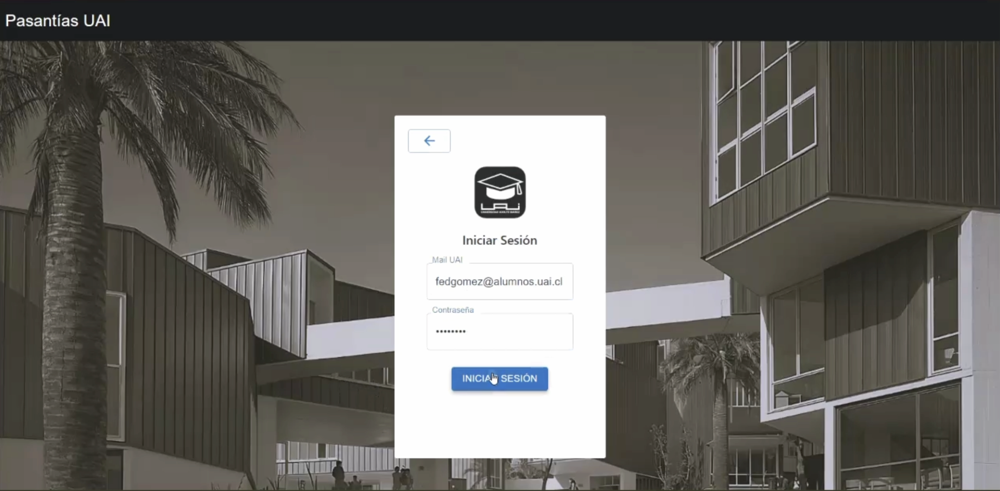

# Pasantías Paso a Paso 
Este proyecto se trata de una solución para universidades que centraliza y simplifica el proceso de inscripción de pasantias/practicas
tanto para alumnos como administradores(Universidad) y supervisores(empleador). 

This project simplifies the process of starting a college internship by consolidating all the processes into one platform, making it
much easier for students and internship coordinators to communicate and navigate the process correctly.

Video Demo:

Pitch Pasantías Paso a Paso: [Abrir Presentación del proyecto](./Pitch)

